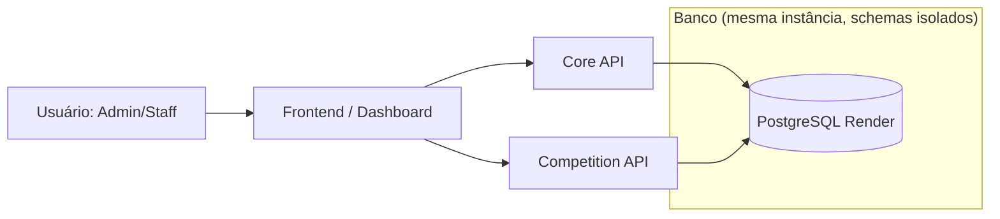
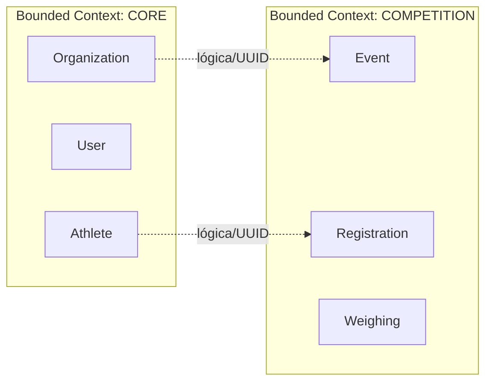

# Shiai System — Arquitetura, Domínio e Integração (visão atual)

## 1. Visão Geral
- O Shiai System é modular e multi-API: cada domínio tem sua própria API e schema no PostgreSQL.
- Objetivo: isolamento de responsabilidade, evolução independente e possibilidade de separar infra no futuro.
- Princípios:
  - Isolamento por schema (`core`, `competition`, `ranking` futuro; `public` legado intocado).
  - Comunicação explícita (contratos claros, sem acesso direto a tabelas de outro domínio).
  - Domínio antes de endpoints (regras em services; endpoints vêm depois).
  - Fail fast (estados inválidos geram erro imediato).

## 2. Papéis de cada API
- Core API (schema `core`):
  - DONO de Organization, User (role-based), Athlete.
  - Fornece leitura/validação de identidade e pertencimento.
  - NÃO cria/gerencia eventos, inscrições ou pesagens.
  - Não usa `auth_permission`; controle via `role` (ADMIN/STAFF).
- Competition API (schema `competition`):
  - DONO de Event, Registration, Weighing.
  - Controla fluxo de evento (DRAFT→OPEN→CLOSED) e inscrição/pesagem (PENDING→WEIGHED→APPROVED / BLOCKED).
  - NÃO cria/edita dados do Core; só consome por contrato (UUIDs validados).

## 3. Diagramas (Mermaid)

### 3.1 C4 Nível 1 — Contexto


### 3.2 C4 Nível 2 — Contêineres
```mermaid
flowchart TB
  web[Frontend / Dashboard] --> core[Core API (Django/DRF)\nSchema: core]
  web --> comp[Competition API (Django/DRF)\nSchema: competition]

  core --> dbcore[(PostgreSQL\nschema core)]
  comp --> dbcomp[(PostgreSQL\nschema competition)]

  subgraph "Render PostgreSQL (1 instância)"
    dbcore
    dbcomp
  end
```

### 3.3 Domínio — Entidades e Fronteiras

Notas:
- Relações são lógicas via UUID (sem ForeignKey entre schemas).
- Organization liga-se a Event por `organization_id` (UUID).
- Athlete liga-se a Registration por `athlete_id` (UUID).

## 4. Invariantes (já implementadas em services)
- Competition:
  - Não criar Registration se `Event.status != OPEN`.
  - Não criar Weighing se `Registration.status != PENDING`.
  - Não registrar/alterar peso se `Registration.status == BLOCKED`.
  - Aprovar só se `Registration.status == WEIGHED`.
  - Geração de chaves depende de `Event.status == CLOSED` (fora do escopo atual).
- Core:
  - Acesso e pertencimento validados via services; controle por `role` (ADMIN/STAFF).

## 5. Plano de Integração Controlada (conceitual, sem código)
- Verdade dos dados:
  - Core é dono de Organization, User, Athlete.
  - Competition é dona de Event, Registration, Weighing.
- O que pode ser consultado:
  - Competition pode LER Organization e Athlete via contrato do Core.
  - Core pode LER status de Event/Registration/Weighing via contrato da Competition.
- O que não pode ser feito por outra API:
  - Competition não altera Athlete/User/Organization.
  - Core não cria/edita Event/Registration/Weighing.
- Contratos conceituais (exemplos):
  - Competition consulta Athlete (read-only) antes de registrar inscrição.
  - Competition não grava nada no schema core.
  - Core não cria Registration.
- Estratégias possíveis (a decidir depois):
  - HTTP REST síncrono entre serviços.
  - Gateway/API Gateway para unificar entrada.
  - Autenticação service-to-service + headers de correlação (`X-Request-ID`, `X-Organization-ID`).
  - Cache de leitura / snapshot de existência (e.g., `athlete_exists`) se necessário.
- Riscos a evitar:
  - Acoplamento direto a tabelas de outro schema.
  - Violação de invariantes (pular services).
  - Efeito cascata por falta de timeouts/erros claros.

## 6. Próximos passos (quando autorizado)
- Definir e implementar contratos HTTP entre Core e Competition.
- Adicionar autenticação entre serviços e política de timeouts.
- Somente então criar endpoints públicos e gateways.

---
Regra de ouro: se a regra de negócio não está em um `services.py` do domínio correto, ela está no lugar errado.

