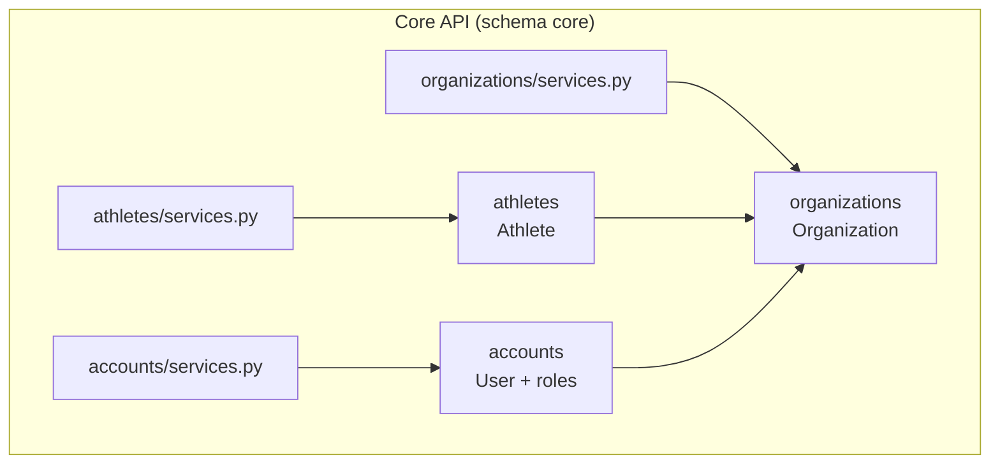

# C4 — Componentes (Core)

```mermaid
flowchart TB
  subgraph core["Core API (schema core)"]
    org[organizations\nOrganization]
    acc[accounts\nUser + roles]
    ath[athletes\nAthlete]
    orgsvc[organizations/services.py]
    accsvc[accounts/services.py]
    athsvc[athletes/services.py]
  end

  orgsvc --> org
  accsvc --> acc
  athsvc --> ath
  ath --> org
  acc --> org
```

Regras:
- Services concentram validação e acesso seguro.
- Sem uso de `auth_permission`; controle via `role` (ADMIN/STAFF).

