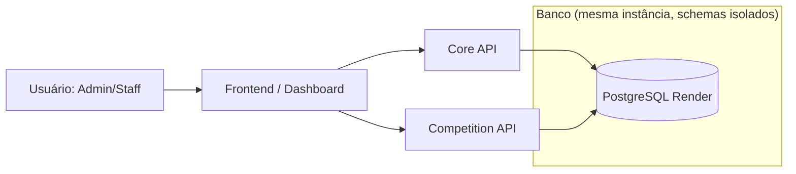

# C4 — Nível de Contexto (System Context)

Notas:
- Uma única instância PostgreSQL com schemas isolados (`core`, `competition`, `ranking` futuro, `public` legado).
- Core e Competition não compartilham modelos; comunicação ocorre por contratos/API e UUIDs.

