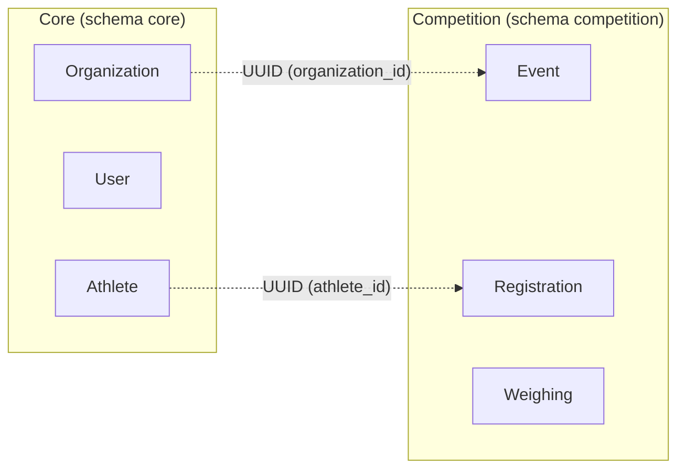

# Domínio — Bounded Contexts e Fronteiras

## Bounded Contexts

Notas:
- Relações são lógicas via UUID; não existem ForeignKeys entre schemas.
- Core não conhece Event/Registration/Weighing; Competition não conhece modelos do Core.
- Integração futura ocorrerá via services/adapters, não via ORM cruzado.

## Dados que cruzam fronteira (planejado)
- UUID de Organization (para saber o dono do evento e das inscrições).
- UUID de Athlete (para vincular inscrição a um atleta existente no Core).

## Dados que NÃO cruzam
- Modelos/ORM ou joins entre schemas.
- Campos sensíveis do Core (credenciais, etc.).

## Ponto de integração futura
- Services → Adapters HTTP (Core ↔ Competition), com validação e fail-fast antes de criar/alterar estado na Competition.

