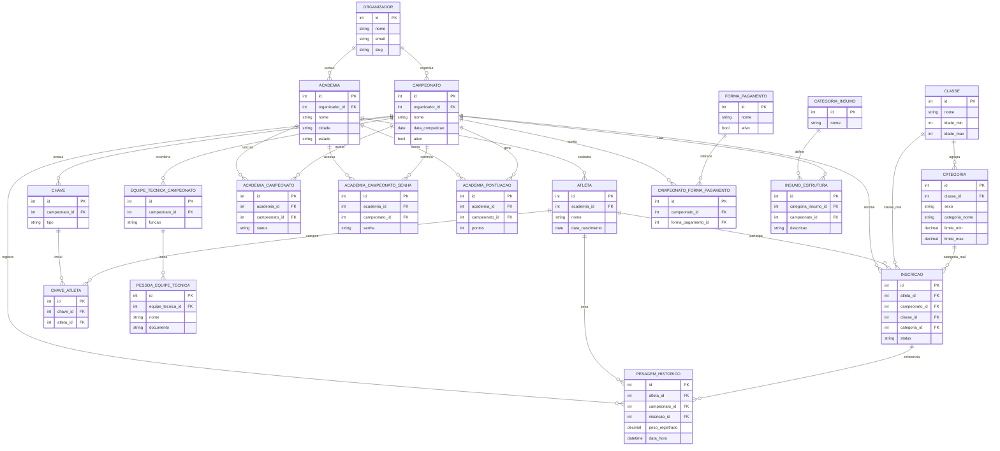

```mermaid
erDiagram
    ORGANIZADOR {
        int id PK
        string nome
        string email
        string slug
    }

    ACADEMIA {
        int id PK
        int organizador_id FK
        string nome
        string cidade
        string estado
    }

    CAMPEONATO {
        int id PK
        int organizador_id FK
        string nome
        date data_competicao
        bool ativo
    }

    ATLETA {
        int id PK
        int academia_id FK
        string nome
        date data_nascimento
    }

    CLASSE {
        int id PK
        string nome
        int idade_min
        int idade_max
    }

    CATEGORIA {
        int id PK
        int classe_id FK
        string sexo
        string categoria_nome
        decimal limite_min
        decimal limite_max
    }

    INSCRICAO {
        int id PK
        int atleta_id FK
        int campeonato_id FK
        int classe_id FK
        int categoria_id FK
        string status
    }

    CHAVE {
        int id PK
        int campeonato_id FK
        string tipo
    }

    CHAVE_ATLETA {
        int id PK
        int chave_id FK
        int atleta_id FK
    }

    PESAGEM_HISTORICO {
        int id PK
        int atleta_id FK
        int campeonato_id FK
        int inscricao_id FK
        decimal peso_registrado
        datetime data_hora
    }

    ACADEMIA_CAMPEONATO {
        int id PK
        int academia_id FK
        int campeonato_id FK
        string status
    }

    ACADEMIA_CAMPEONATO_SENHA {
        int id PK
        int academia_id FK
        int campeonato_id FK
        string senha
    }

    ACADEMIA_PONTUACAO {
        int id PK
        int academia_id FK
        int campeonato_id FK
        int pontos
    }

    EQUIPE_TECNICA_CAMPEONATO {
        int id PK
        int campeonato_id FK
        string funcao
    }

    PESSOA_EQUIPE_TECNICA {
        int id PK
        int equipe_tecnica_id FK
        string nome
        string documento
    }

    FORMA_PAGAMENTO {
        int id PK
        string nome
        bool ativo
    }

    CAMPEONATO_FORMA_PAGAMENTO {
        int id PK
        int campeonato_id FK
        int forma_pagamento_id FK
    }

    CATEGORIA_INSUMO {
        int id PK
        string nome
    }

    INSUMO_ESTRUTURA {
        int id PK
        int categoria_insumo_id FK
        int campeonato_id FK
        string descricao
    }

    ORGANIZADOR ||--o{ ACADEMIA : possui
    ORGANIZADOR ||--o{ CAMPEONATO : organiza
    ACADEMIA ||--o{ ATLETA : cadastra

    CAMPEONATO ||--o{ INSCRICAO : recebe
    ATLETA ||--o{ INSCRICAO : participa
    CLASSE ||--o{ CATEGORIA : agrupa
    CLASSE ||--o{ INSCRICAO : classe_real
    CATEGORIA ||--o{ INSCRICAO : categoria_real

    CAMPEONATO ||--o{ CHAVE : possui
    CHAVE ||--o{ CHAVE_ATLETA : inclui
    ATLETA ||--o{ CHAVE_ATLETA : compoe

    CAMPEONATO ||--o{ PESAGEM_HISTORICO : registra
    ATLETA ||--o{ PESAGEM_HISTORICO : pesa
    INSCRICAO ||--o{ PESAGEM_HISTORICO : referencia

    ACADEMIA ||--o{ ACADEMIA_CAMPEONATO : vincula
    CAMPEONATO ||--o{ ACADEMIA_CAMPEONATO : aceita

    ACADEMIA ||--o{ ACADEMIA_CAMPEONATO_SENHA : acessa
    CAMPEONATO ||--o{ ACADEMIA_CAMPEONATO_SENHA : controla

    ACADEMIA ||--o{ ACADEMIA_PONTUACAO : soma
    CAMPEONATO ||--o{ ACADEMIA_PONTUACAO : gera

    CAMPEONATO ||--o{ EQUIPE_TECNICA_CAMPEONATO : coordena
    EQUIPE_TECNICA_CAMPEONATO ||--o{ PESSOA_EQUIPE_TECNICA : inclui

    CAMPEONATO ||--o{ CAMPEONATO_FORMA_PAGAMENTO : aceita
    FORMA_PAGAMENTO ||--o{ CAMPEONATO_FORMA_PAGAMENTO : oferece

    CATEGORIA_INSUMO ||--o{ INSUMO_ESTRUTURA : define
    CAMPEONATO ||--o{ INSUMO_ESTRUTURA : usa
```
