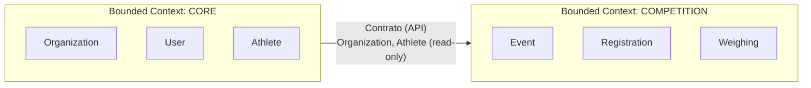

# Domínio — Bounded Contexts

```mermaid
flowchart LR
  subgraph CORE["Bounded Context: CORE"]
    Organization
    User
    Athlete
  end

  subgraph COMP["Bounded Context: COMPETITION"]
    Event
    Registration
    Weighing
  end

  CORE -- "Contrato (API)\nOrganization, Athlete (read-only)" --> COMP
```

Notas:
- CORE fornece identidade (organização, usuário, atleta).
- COMPETITION consome apenas UUIDs e valida via contratos (sem acesso direto ao schema core).

