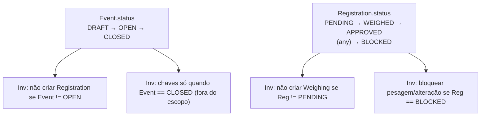

# Domínio — Invariantes da Competition API

Resumo das regras:
- Criação de inscrição exige `Event.status == OPEN`.
- Pesagem exige `Registration.status == PENDING` e não pode ocorrer se `status == BLOCKED`.
- Aprovação exige pesagem prévia (`status == WEIGHED`).
- Geração de chaves depende de evento `CLOSED` (fora do escopo atual).

